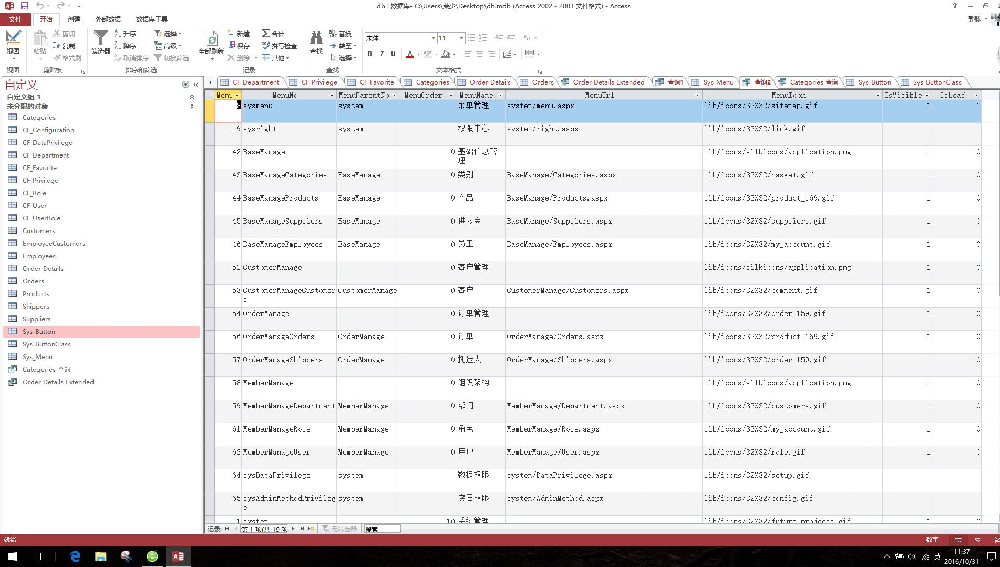
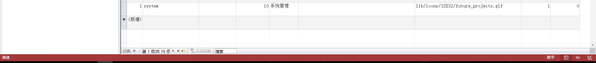
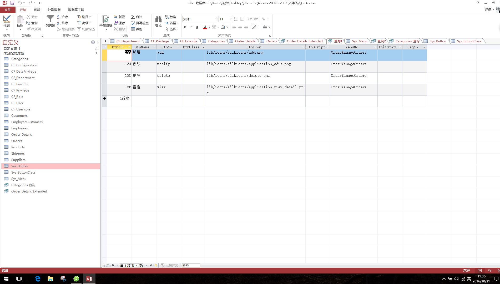

## 一、查询用户test1可以查看的页面（Sys_menu）
### 1.SQL语句
### select * from Sys_Menu 
### where MenuID in
### (
### select PrivilegeAccessKey from CF_Privilege where PrivilegeAccess="Sys_Menu" and PrivilegeOperation="Permit" and PrivilegeMasterKey in
### (
### select RoleID from CF_UserRole where UserID in
### (
### select UserID from CF_User where LoginName="test1"
### )
### )
### )
### 2.截图

## 二、查询用户test1可以对订单(order)页面中的操作权限(sys_button)
### 1.SQL语句
### select * from Sys_Button 
### where MenuNo="OrderManageOrders" and BtnID in
### (
### select PrivilegeAccessKey from CF_Privilege where PrivilegeAccess="Sys_Button" and PrivilegeOperation="Permit" and PrivilegeMasterKey in
### (
### select RoleID from CF_UserRole where UserID in
### (
### select UserID from CF_User where LoginName="test1"
### )
### )
### )
### 2.截图

## 三、伪代码权限获取的逻辑过程
### 查询用户test1可以查看的页面
### 1.a.根据用户LoginName查询其UserID。
### 2.b.通过UserID查找对应的RoleID。
### 3.c.For 查找到的RoleID.
### d.根据相应的RoleID从权限表中查询其可查看的页面。
###
### 查询用户test1可以对订单页面中的操作权限
### 1.a.根据用户LoginName查询其UserID。
### 2.b.通过UserID查找对应的RoleID。
### 3.c.For 查找到的RoleID.
###  d.根据相应的RoleID从权限表中查询可以对订单页面中的操作权限
